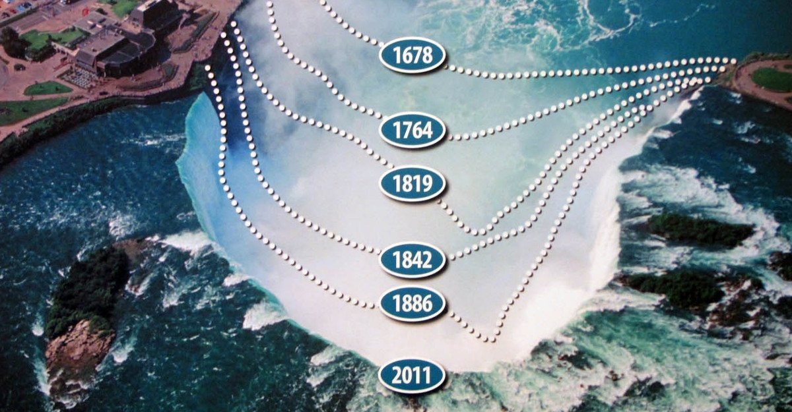
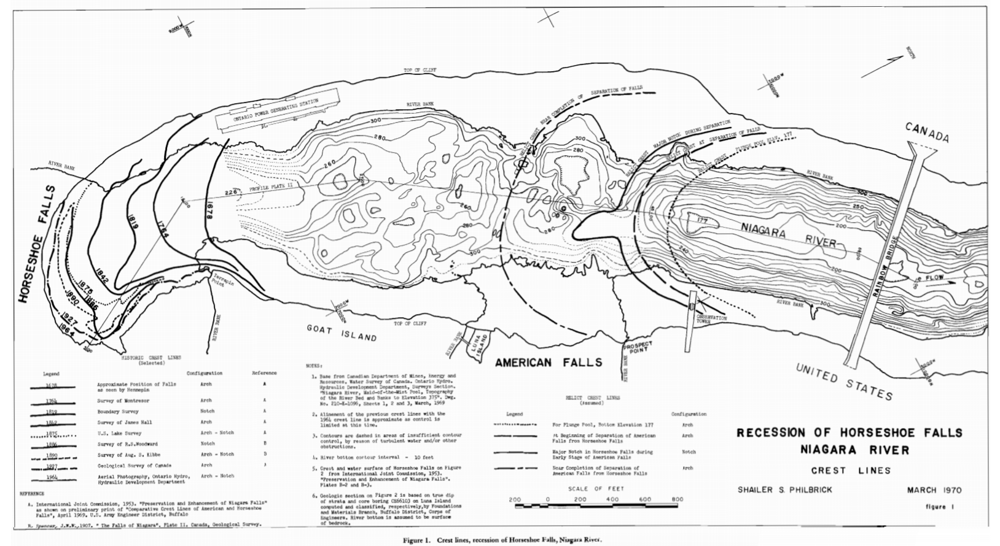

 
# Background

The landscape around Niagara Falls has been shaped by this water flow for a long time. Maybe you have at least a general idea of erosion – the process of earth and rock being worn away by the elements (wind and water). It’s not a quick process, but it is a massive change of scenery on the right scale – one example of this being the way Niagara has changed over the past few thousand years – a change that is still happening today.

Niagara Falls has moved 7 miles The massive volume of water going over the falls slowly wears away at the riverbed at the top of the falls. The result is that the waterfall is moving upstream. Estimates vary, but in the past 12,500 years Niagara Falls has moved about 7 miles (11 kilometers) towards Lake Erie.

Here I choose Horseshoe Falls as the research object because Horseshoe Falls show more significant erosion process.  




# Questions

According to current Niagara Falls’ condition, this project will figure out these questions:
  
* How fast is the waterfall moving towards Lake Erie from 1678 to now?
* How does the speed of erosion change during the long period?


# Hypotheses

The erosion speed in Horseshoe Falls increases gradually. This is because the volume of flow from the Horseshoe Falls is decreasing. So nowadays,the speed is larger.


# Methods
In this research, I set change of volume of flow as the parameter to measure the erosion process.

Specific steps as below.

1)	This image shows the historical crest lines from 1679 to 1964, Geo-reference this image to known DEM data in ArcGIS.



2)	Collect 1964-2017 crest lines of Horseshoe Falls from Google maps.
3)	Create a vector data to draw the historical crest lines from 1679 until now.
4)	Extract area and height of Horseshoe Falls in R or ArcGIS during the long time period.

e.g:
```{r, fig.width=6, fig.height=3, fig.cap="Map illustrating the known occurrence locations"}
# load the raster, sp, and rgdal packages
library(raster)
library(sp)
library(rgdal)
#install.packages("rgdal")
# set working directory to data folder
DEM <- raster("./p7elu.DEM")
plot(DEM)

```

5)	Put these data into R studio to calculate the change of volume and make some graphs. 
6)	Analysis the fluctuation of the rate change.


# References
*SHAILER S. PHILBRICK,Horizontal Configuration and the Rate of Erosion of Niagara Falls, Geological Society of America Bulletin, v. 81, p. 3723-3732, 3 figs., December 1970*
  
#Data Source
http://www.ny.gov/

```


